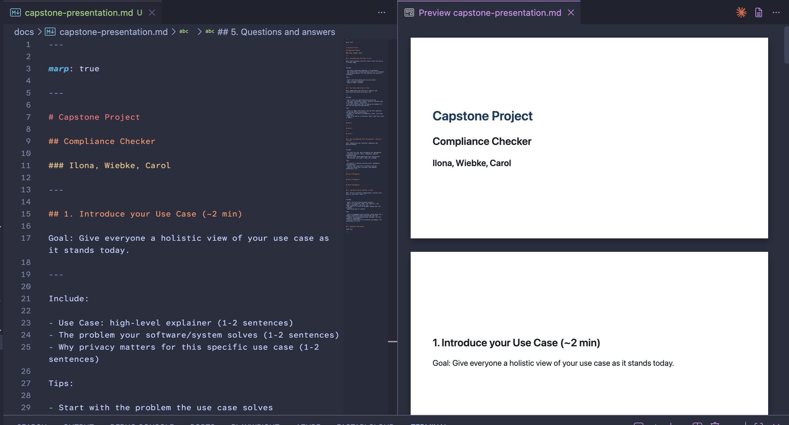

# compliance-checker

Privacy audit for [doc quality compliance checker](https://github.com/IloBe/doc_quality_compliance_check)

This repo holds information related to a privacy audit.

## Project for audit

[Repo for doc_quality_compliance_check](https://github.com/IloBe/doc_quality_compliance_check) by Ilona Brinkmeier

## Privacy audit

[Website](https://willingc.github.io/compliance-checker/)

---

## Contribute to the documentation

- Add a document page in markdown in the `docs` folder.
- Add the document to the `nav` section in the `zensical.toml` file.
- Add images to the `docs/images` folder.

### Build and run docs locally

1. Install pixi if needed: <https://pixi.prefix.dev/v0.19.0/#installation>
2. Using pixi from the terminal. At the root of the repo, run:

    ```sh
    pixi run serve
    ```

3. Navigate to <http://127.0.0.1:8000/compliance-checker> in your browser to view the documentation.

---

## Capstone presentation

In `docs/capstone-presentation.md`

### Set up marp extension

1. In vscode, add Marp for VSCode extension.

2. Open the `docs/capstone-presentation.md` file.

3. Preview the document and you should see the slides.



### Add and use themes

There are three built-in themes: default, gaia, and uncover. Set in the header block at top of file.

To use the `rose-pine` custom theme:

1. Check if you have a `.vscode` directory at the root of your repo.

    - If no, create the `.vscode` directory. Then go to Step 2.
    - If yes, go to step 2.

2. You will need to create and/or edit a `settings.json` file in the `.vscode` directory.
3. Add the following to `settings.json`:

    ```json
    {
    "markdown.marp.themes": [
        "./themes/rose-pine.css",
        "./themes/rose-pine-moon.css",
        "./themes/rose-pine-dawn.css"
    ]
    }
    ```

4. You should now be able to use `rose-pine`, `rose-pine-dawn`, and `rose-pine-moon` as themes.

### More marp info

To convert md file to html:

```sh
marp docs/capstone-presentation.md -o docs/capstone-presentation.html
```

To present, either:

`open docs/captone-presentation.html`

or

`python3 -m http.server` and navigate to `localhost:8000/docs/capstone-presentation.html`

To convert md file to pdf:

```sh
marp --pdf --allow-local-files docs/capstone-presentation.md
```

There is also a [marp app](https://marp.app/) and a marp-cli.
