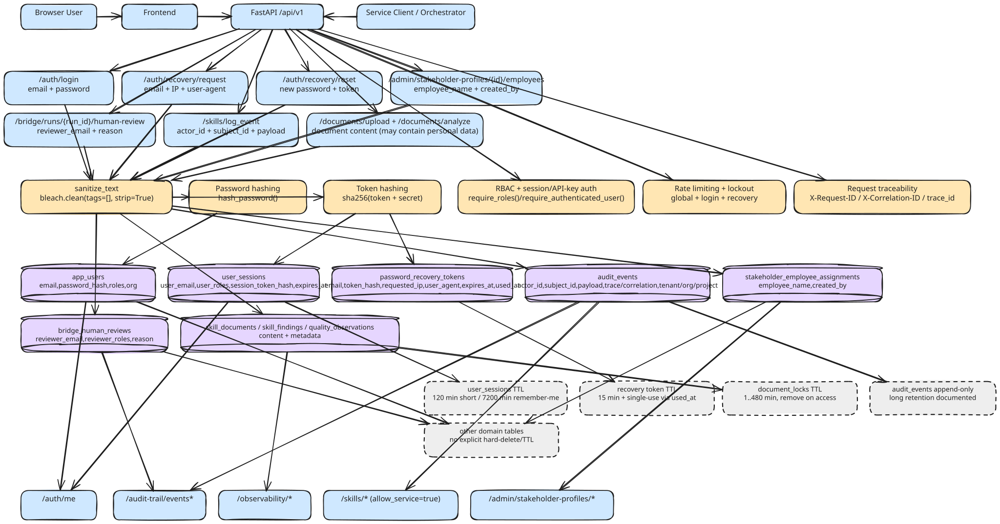

# Identify use cases and data flows

!!! note "Week 1"

    Identify use cases and compose data flow diagrams for privacy.

## Use cases

- 1: validate basic auth privacy controls (session cookie + no plain credentials persistence)
- 2: validate password recovery privacy safety (recovery token TTL + single-use)
- 3: verify that PII-adjacent endpoints are role-protected (RBAC protection of PII access)
- 4: verify user-supplied text is sanitized before being persistence or used (input sanitization of potential PII payload)
- 5: verify machine client scope and privacy auditability (service-client boundary + traceability consistency)

## Data flow diagrams

## Data privacy diagram

## Component diagram

