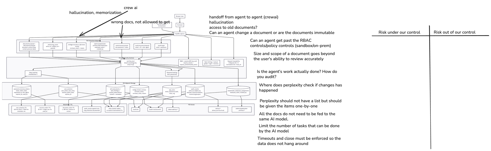

# Risk level 4: Secrets, tokens, and keys

**AI System Privacy Audit: Documentation Quality Compliance Checker**

!!! note Priority 4

    Secrets, tokens, and keys

## 1. System Diagram

## 2. Data Flow Analysis

| Data Flow    | Source  | Destination | Encrypted? | Logged? | Priority |
| ------------ | ------- | ----------- | ---------- | ------- | -------- |
| User input   | Web app | LLM API     | In-transit | Yes     | High     |
| Model output | LLM API | Database    | No         | 50%     | Medium   |

## 3. Sensitive Data

### Sensitive Data Name: Secrets, tokens, and keys

- **Category:** Access keys and passwords
- **Examples:** Usernames and passwords, roles, API keys to external services
- **Why Sensitive:** Sensitive because they can be used to gain access to personal information stored in the documents and databases
- **Current Protection:** Best practices of handling authentication and authorization
- **Risk (or Harm) if Exposed:** Personal information and user information may be accessed.

## 4. Privacy Risks

### Risk 4: Secrets, tokens, and keys

- **Priority:** [Low]
- **Risk Category:** [additional data related to access]
- **Potential Harm/Impact:** What happens if this risk isn't addressed?
- **Ability to Implement Control:** [High]
- **Recommended controls:**
  - Use principle of least privilege for all data access
  - Revoke privileges when not needed or time-bound access
  - Search the code for any committed secrets
  - Educate users on the importance of password protection and sharing of data

---

## Additional information from the repo

Brief inventory of **sensitive configuration and credential surfaces** in this repository. **Do not commit real values**; use `.env` (gitignored) or your platform’s secret store. Defaults in example files and `docker-compose.yml` are for local development only.

### Environment variables (main API)

Loaded via `src/doc_quality/core/config.py` (`Settings`) and `.env.example`.

| Name | Role |
| --- | --- |
| `SECRET_KEY` | Session signing, cookie security context, and **API auth** for routes using `require_api_auth` (`X-API-Key` or `Authorization: Bearer …` must match this value). |
| `DATABASE_URL` | DB connection string; embeds DB user **password** in the URL. |
| `AUTH_MVP_EMAIL` / `AUTH_MVP_PASSWORD` | MVP bootstrap user (dev/demo); password must meet app policy (≥12 chars in production paths). |
| `AUTH_MVP_ROLES` / `AUTH_MVP_ORG` | RBAC/org binding for the MVP user (not cryptographic secrets, but identity policy). |
| `ANTHROPIC_API_KEY` | Optional LLM provider key for document enrichment paths. |
| `PERPLEXITY_API_KEY` | Optional key for live regulatory research (`research_service`, MCP). |

Related non-secret toggles that affect exposure of recovery material: `AUTH_RECOVERY_DEBUG_EXPOSE_TOKEN` (must stay off outside development).

### Environment variables (standalone orchestrator)

Loaded via `services/orchestrator/src/doc_quality_orchestrator/config.py` (`OrchestratorSettings`).

| Name | Role |
| --- | --- |
| `API_SECRET_KEY` | Protects orchestrator HTTP endpoints (`X-API-Key` / `Bearer`); empty disables enforcement (see orchestrator `main.py`). |
| `ANTHROPIC_API_KEY` | Provider key for crew/scaffold LLM calls in the orchestrator process. |
| `NEMOTRON_API_KEY` | Optional key when Nemotron endpoints are configured. |
| `BACKEND_BASE_URL` | Not a secret by itself, but must align with how the main API expects orchestrator callbacks; avoid leaking internal URLs in client-facing configs. |

### HTTP headers (runtime secrets, not in repo)

| Header | Use |
| --- | --- |
| `X-API-Key` | Same value as `SECRET_KEY` (API) or `API_SECRET_KEY` (orchestrator), depending on service. |
| `Authorization: Bearer <token>` | Alternate form of the same shared secrets above. |
| `X-Request-ID` / `X-Correlation-ID` / `X-Trace-ID` | Correlation identifiers (not secrets; listed in observability docs). |

### Persisted secrets (database, not environment)

| Surface | Notes |
| --- | --- |
| Session cookies (`dq_session`) | Opaque cookie; server stores **hashed** session token (`UserSessionORM.session_token_hash`). |
| User passwords | Stored as **hashes** only (`AppUserORM.password_hash`). |
| Password recovery | Single-use recovery flow uses **hashed** tokens in `password_recovery_tokens` (raw token only sent to user, not stored). |

### IDE / local tooling

| Location | Secret |
| --- | --- |
| `.vscode/mcp.json` | References `${env:PERPLEXITY_API_KEY}` for the Perplexity MCP server (key stays in the shell environment, not in the file). |

### Frontend

`frontend/.env.local.example` defines **public** origins (`NEXT_PUBLIC_*`) only—no API keys. The browser authenticates with **httpOnly cookies** issued by the backend after login.

### Development defaults (rotate for anything real)

| Source | What |
| --- | --- |
| `docker-compose.yml` | `POSTGRES_PASSWORD=postgres` for the local Postgres container. |
| `Settings` / `OrchestratorSettings` code defaults | Placeholder `change-me-in-production` strings; production startup fails if `SECRET_KEY` is left at the API default. |

### Test fixtures

`.env.test` contains **intentionally weak, committed test-only** values (e.g. `SECRET_KEY=test-api-key`). Use only under pytest, never in deployed environments.
