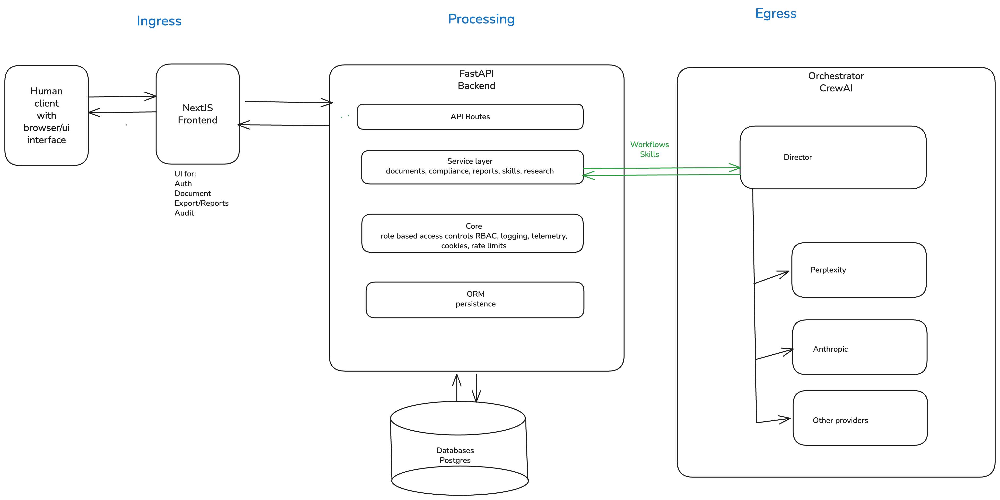

# Documentation Quality Compliance Checker

Ilona Brinkmeier Wiebke Meyer Carol Willing

---

<!--
backgroundColor:  #3A7D7B
color: #F8F6F0
-->

_1._

# Documentation Quality Compliance Checker

---

_1.0_

# Audit subject and use case

Subject: https://github.com/IloBe/doc_quality_compliance_check Detailed privacy
audit: https://willingc.github.io/compliance-checker/

<!--
## 1. Introduce your Use Case (~2 min)

Goal: Give everyone a holistic view of your use case as it stands today.

---

Include:

- Use Case: high-level explainer (1-2 sentences)
- The problem your software/system solves (1-2 sentences)
- Why privacy matters for this specific use case (1-2 sentences)

Tips:

- Start with the problem the use case solves
- Why is privacy relevant?
- Keep it under 2 minutes

-->

---

_1.1_ **High-level architecture**

- Human operator
- NextJS frontend
- FastAPI backend
- Postgres database
- Orchestrator and agents

---

_1.2_

### Real-world problem

Insert brief description of the problem solved

---

_1.3_

### Privacy matters

Insert brief list of why privacy matters

---

<!--
backgroundColor: #C66B3D
-->

_2._

# Privacy risks

---

_2.0_

# Top privacy risks

1. Egress traffic flow data to orchestrator and models
2. Application telemetry and workflow tracing
3. Role-based access controls and GDPR compliance

<!--
## 2. Top Risks Identified (~4 min)

Goal: Demonstrate your ability to identify and prioritize real world AI privacy risk.

---

Include:

- Top 3 risks you identified and prioritized
- Why each risk matters (harms, severity, business and/or customer impact, compliance)
- How you prioritized risk, including one example of a top risk you deprioritized and why

Tips:

- Focus on impact and control, why was this important and how/why did you prioritize?
- Connect to real-world consequences (fines, user harm, reputation)
- Keep it AI-centric if possible (that's what this class is about!)

-->

---

_2.1_ **Risk Area 1**

### Egress traffic flow data to orchestrator and models

Sensitive data:

- External model: transfer of potentially personal prompt/output data
  - **Data**: Names, emails, stakeholder assignments, reviewer identifiers,
    document passages copied into prompts, generated summaries that may restate
    personal data
  - **Why Sensitive**: Leaves the primary application context during model
    inference (current external-provider path)

---

- Over-collection and -retention in model observability traces
  - **Data**: provider, model_used, trace_id, correlation_id, latency/tokens,
    rich payload entries, prompt/output snapshots
  - **Why Sensitive**: Enables reconstruction of who triggered what model action
    and when; can become re-identifiable when combined with audit tables

---

- Model credentials and routing configuration
  - **Data**: API keys, adapter routing flags, provider selection settings
  - **Why Sensitive**: Compromise enables data exfiltration or unauthorized
    model usage

---

_2.2_ **Risk Area 2**

### Application telemetry and workflow tracing

Sensitive data:

- Raw LLM promp and output in quality_observations.payload
  - **Data**: payload.provider, payload.model_used, payload.llm_temperature
  - payload.llm_prompt (document text submitted by user, stakeholder names,
    reviewer assignments)
  - payload.llm_output (generated compliance summaries restating personal
    context)

---

- **Why Sensitive**:
  - Prompt context is assembled from user-submitted documents which routinely
    contain names, emails, project identifiers, and business-sensitive content
  - the output may restate or summarise that content
  - both are persisted to a queryable table

---

- Audit event payload in audits_events.payload
  - **Data**: payload.roles (user role at login), payload.remember_me flag,
    event-specific context fields, any free-form data inserted by orchestrator
    or Skills API callers
  - **Why Sensitive**:
    - Append-only and intended for long retention;
    - no technical control prevents a caller from writing personal data into the
      payload column
    - combined with actor_id (user email) it forms a rich personal profile

---

**Risk Area 2**

- OTEL (open telemetry) span attributes (exporter config)
  - **Data**: HTTP path attribute (e.g., /api/v1/documents/doc-abc123 — document
    ID in path), user_agent, http.method, http.status_code, trace_id / span_id
    (linkable back to session)
  - **Why Sensitive**:
    - When TRACING_EXPORTER=otlp span data is sent to an external collector,
      - path values can embed document or session identifiers;
      - user-agent can contribute to fingerprinting

---

**Risk Area 2**

- Frontend CSV export of prompt/output pairs
  - **Data**: Exported observability*prompt_output_pairs*\*.csv file containing
    prompt, output, source_component, trace_id, timestamps
  - **Why Sensitive**:
    - Created on the user's local filesystem;
    - outside system access controls, retention policy, and audit log;
    - may contain personal data from documents processed during the export
      window

---

_2.3_ **Risk Area 3**

### Role-based access controls and GDPR compliance

Sensitive data:

- User identity in session store
  - **Data**:
    - user_email (primary identifier), user_org, session session_id, expires_at,
      last_seen_at
  - **Why Sensitive**:
    - Directly identifies users and links their organisational role to access
      patterns and audit trails
    - Retained in PostgreSQL with no visible TTL-based purge policy

---

- Role assignments and permission scope
  - **Data**:
    - user_roles array per session row (e.g., ["qm_lead"], ["auditor"]), org
      isolation field user_org
  - **Why Sensitive**:
    - Reveals organisational responsibilities and access privileges
    - Can be used for social engineering or targeted attacks
    - GDPR data minimisation applies

---

- Bootstrap/MVP credentials in environment configuration
  - **Data**:
    - AUTH_MVP_EMAIL, AUTH_MVP_PASSWORD, AUTH_MVP_ROLES, AUTH_MVP_ORG (env
      vars); SECRET_KEY (API key secret)
  - **Why sensitive**:
    - Compromise of bootstrap credentials gives attacker a fully provisioned
      account with configurable roles
    - SECRET_KEY grants service-client access to skills and observability

---

- Access decision and audit context not separately persisted
  - **Data**:
    - Which role accessed which route at what time
    - 403 access denials
    - service-client route usage with payload summary
  - **Why sensitive**:
    - Absence of access-decision audit log prevents retrospective investigation
      of data-access incidents
    - Required for GDPR Art. 30 record of processing activities and breach
      response

---

<!--
backgroundColor: #3D5A80
color: #F7F0EA
-->

_3._

# Mitigations and controls

---

_3.0_

# Mitigations and controls

- Mitigation implemented
- Technical details
- Selected approach vs. alternatives
- Outcome and learnings

<!--
## 3. How You Addressed Them (Mitigations + Controls) (~4 min)

Goal: Demonstrate your technical competence and decision-making.

---

Include:

- For each top risk: what mitigation you implemented
- Technical details: tools, frameworks, specific implementations
- Why you chose these approaches over alternatives
- What worked, what didn't, what you'd change

Tips:

- Be specific — mention concrete tools, parameters, configurations
- Explain your trade-offs — nothing is perfect
- Show you tested your solutions (red teaming, evaluations, etc.)

-->

---

_3.1_ **Mitigating Risk 1**

### Egress traffic flow data to orchestrator and models

---

_3.2_ **Mitigating Risk 2**

### Application telemetry and workflow tracing

---

_3.3_ **Mitigating Risk 3**

### Role-based access controls and GDPR compliance

---

<!--
backgroundColor: #7D5A7D
color: #F7F0EA
-->

_4._

# Recommendations

---

_4.0_

# Recommendations

## Top priority

- Insert what it is
- Insert why it is important
- Insert why it matters to company and risk strategy
- Insert what value does it create

<!--
## 4. Top Next Priority and Why (~3 min)

Goal: Practice executive communication: Convince your boss (or your boss's boss :) ).

---

Include:

- What's your #1 priority going forward?
- Why is it important? (ROI, risk reduction, user impact, compliance, security, etc...)
- How does it fit into the broader company and risk strategy?
- What value does it create?

Tips:

- This is management pitch practice. Think about how a company around this might evaluate ROI and risk.
- Connect to business/operational outcomes, not just technical improvements
- Show you understand prioritization and budgets. not everything is a fire

-->

---

<!--
backgroundColor: #F8F6F0
color:
-->

_5.0_

# Questions and answers

Thank you!

### Ilona, Wiebke, Carol
