<!-- _class: title -->

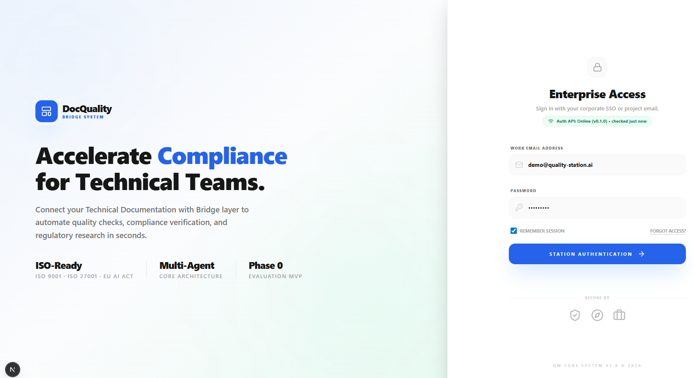

# Documentation Quality Compliance Checker

  Ilona Brinkmeier
  Wiebke Meyer
  Carol Willing

---

<!-- class: sec1 -->
<!-- _class: sec1 divider -->

# Problem

Software teams in regulated or audit-heavy environments (healthcare, fintech, enterprise SaaS or critical infrastructure) often lose significant time during releases because documentation quality and compliance checks are manual, inconsistent and late in the delivery cycle.

---

<!-- _class: sec1 light-body solution-intro -->

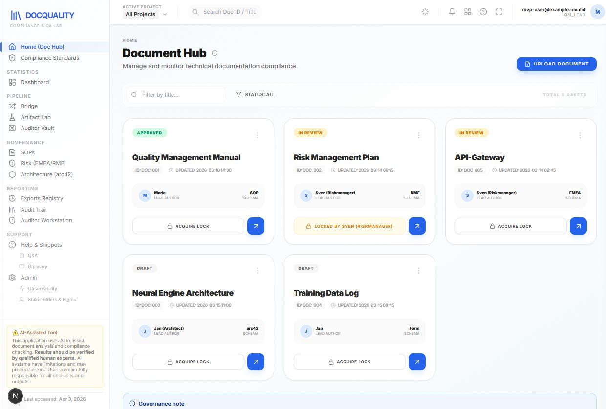

### Initial solution and audit scope

The **Doc Quality Compliance Checker** is a structured, workflow-oriented system that:

- Checks technical documents against governance and quality standards
- Improves consistency across SOP, architecture, and risk artifacts
- Shortens review cycles for QA, compliance, and audit teams
- Surfaces release-risk gaps earlier in the delivery cycle
- Improves traceability for approvals and governance decisions

---

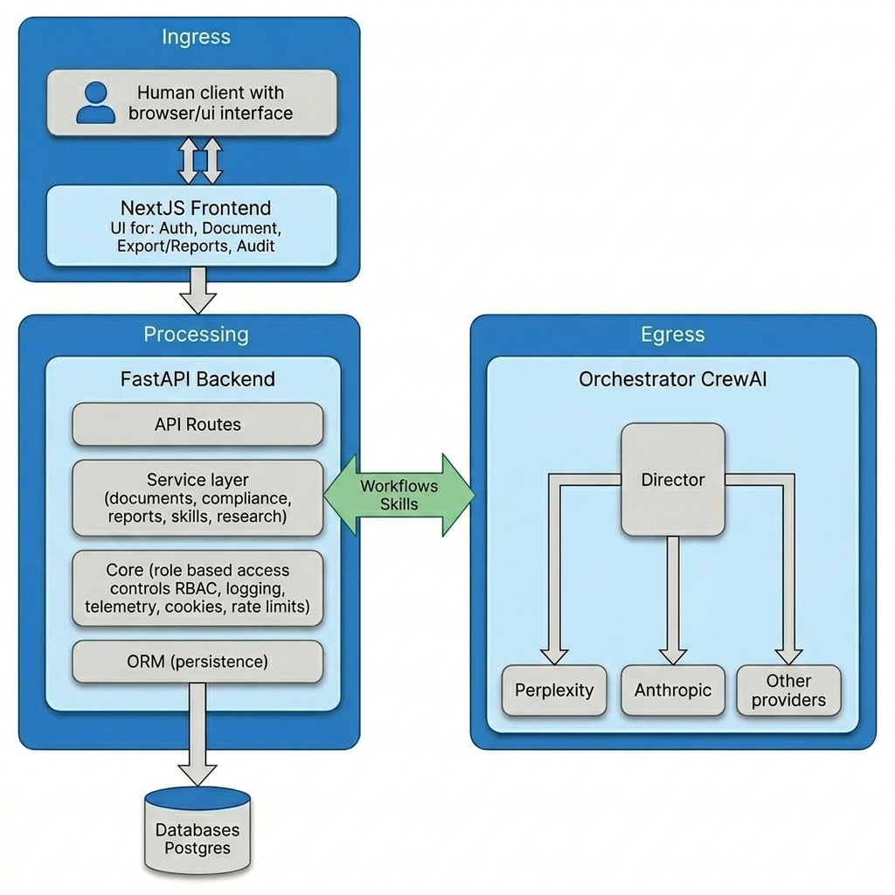

### High-level architecture

- Human operator
- Next.js frontend
- FastAPI backend
- PostgreSQL database
- Orchestrator and external agents
- Excellent documentation and production software engineering practices
- [github.com/Ilobe/doc_quality_compliance_check](https://github.com/IloBe/doc_quality_compliance_check)

---

<!-- _class: sec1 light-body privacy-audit -->



### Privacy-focused audit

**[View audit report →](https://willingc.github.io/compliance-checker/)**

- End-to-end investigation of privacy risks across the stack
- User accounts, roles, and session data (GDPR-relevant)
- Document content and audit trails with business and personal data
- External LLM egress and telemetry expand the trust boundary

---

<!-- class: sec2 dense -->
<!-- _class: sec2 divider risks-overview -->

# Top privacy risks

### Priorities

- Egress traffic flow data to director and external models
- Application telemetry and workflow tracing
- Role-based access controls and GDPR compliance

### Up next: In-depth risk analysis

- Sensitive data
- Why the risk matters
- Priority of the risk
- **Mitigations** for each risk

---

<!-- class: sec31 -->
<!-- _class: sec31 divider section-intro -->

# Egress exposes privacy data

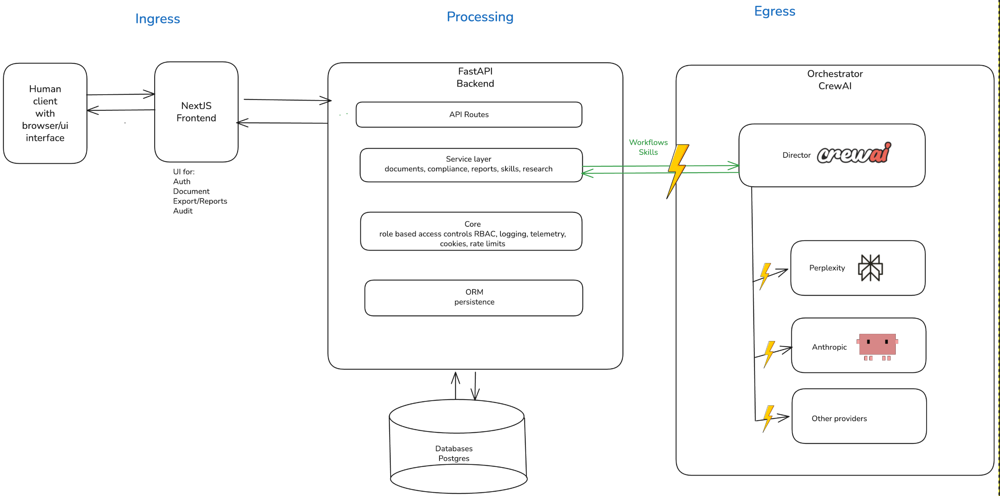

---

<!-- _class: sec31 light-body risk-detail dense -->

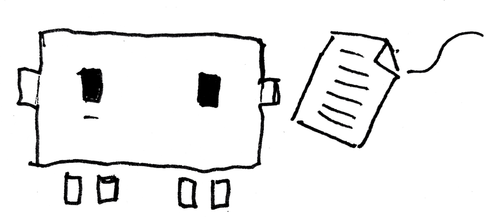
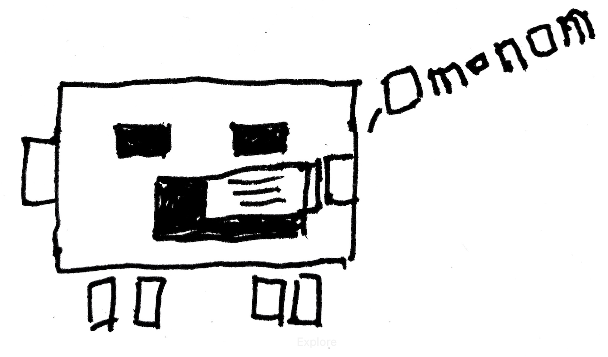

### External model

- **Data**
  - Names, emails, stakeholder assignments, reviewer identifiers, document passages copied into prompts, generated summaries that may restate personal data
- **Why sensitive**
  - Leaves the primary application context during model inference (current external-provider path)

---

<!-- _class: sec31 light-body risk-detail dense -->

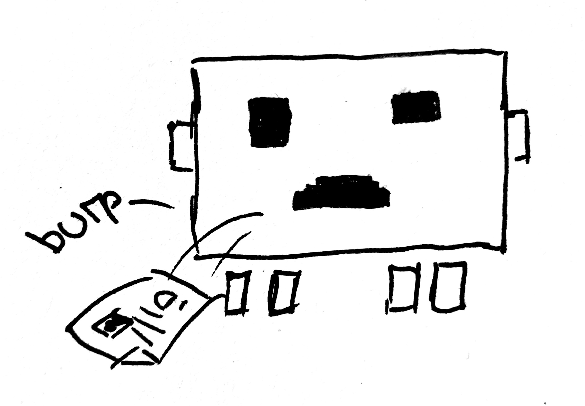

### Observability traces

- **Data**
  - `provider`, `model_used`, `trace_id`, `correlation_id`, latency/tokens, rich payload entries, prompt/output snapshots
- **Why sensitive**
  - Enables reconstruction of _who_ triggered _what_ model action and _when_
  - Can become re-identifiable when combined with audit tables

---

<!-- _class: sec31 light-body risk-detail dense -->

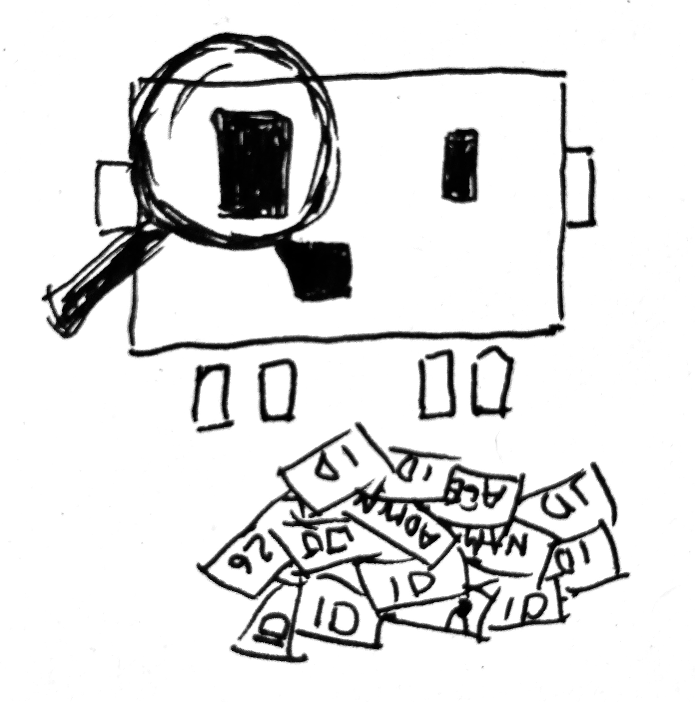

### Model credentials

- **Data**
  - API keys, adapter routing flags, provider selection settings
- **Why sensitive**
  - Compromise enables data exfiltration or unauthorized model usage

---

<!-- _class: sec31 flowchart-slide -->

### Mitigation: Bridge egress flow diagram

<!-- this would be nice on top or top-right -->

_2.2_ **Risk Area 2**

  

---

<!-- _class: sec31 mitigation-brief light-body dense -->

### Mitigation: decision statement about bridge behaviour changes

- **Contract-first execution**
  - Model-using steps must pass mandatory policy metadata validation
- **Personal-data-possible workloads**
  - Must run on-prem models
  - Each model in its own sandbox (containerized)
- **Auditable outcomes**
  - Deny/allow paths must be auditable with actionable operator guidance

The operational model path has shifted <strong>from</strong> remote external GenAI inference <strong>to</strong> locally governed Ollama-based inference for privacy-sensitive workflows, with active model policy and generation parameters controlled through the model-policy admin surface by privileged roles.

---

<!-- _class: sec31 mitigation-brief mitigation-compare light-body dense -->

### Mitigation focus 1: Sensitive data transfer at model boundary

Before

<ul>
<li>Potentially personal prompt/output content could be exposed on remote external inference paths.</li>
</ul>

After

<ul>
<li>Bridge privacy-sensitive path is governed toward local Ollama execution.</li>
<li>Mandatory step policy contract + fail-closed routing denies non-on-prem paths for personal-data-possible steps.</li>
<li>Runtime readiness gate blocks unsafe execution before run continuation.</li>
</ul>

---

<!-- _class: sec31 mitigation-brief mitigation-compare light-body dense -->

**Risk Area 2**

### Mitigation focus 2: Over-collection and retention in model observability traces

Before

<ul>
<li>Rich trace payloads could enable identity/action reconstruction when joined with audit context.</li>
</ul>

After

<ul>
<li>Structured correlation and safe client-envelope filtering are enforced.</li>
<li>Architecture and DoD retention split controls are defined and tracked.</li>
<li>Remaining closure: strict retention-class enforcement + redaction-at-write in telemetry stores.</li>
</ul>

---

<!-- _class: sec31 mitigation-brief mitigation-compare light-body dense -->

**Risk Area 2**

### Mitigation focus 3: Model credentials and routing configuration risk

Before

<ul>
<li>Compromised provider credentials or unsafe routing configuration could enable unauthorized model usage/exfiltration.</li>
</ul>

After

<ul>
<li>Role-restricted model-policy updates control active model priority and generation parameters.</li>
<li>Policy/routing deny paths are explicit, actionable, and auditable.</li>
<li>Remaining closure: dedicated bridge pre-persist secret/token scanner.</li>
</ul>

---

<!-- _class: sec31 mitigation-brief mitigation-controls light-body dense -->

### Why this decision

<ul class="mitigation-rationale">
<li>Privacy risk concentration is highest at model routing boundaries.</li>
<li>Conventional policy text is insufficient for runtime assurance.</li>
<li>Compliance requires deterministic controls plus traceable evidence.</li>
</ul>

#### Implemented architecture controls

<ul class="mitigation-implemented">
<li>Step policy contract validation before execution/routing.</li>
<li>Local Ollama active-model governance with role-restricted parameter updates.</li>
<li>Fail-closed routing for personal-data-possible workloads.</li>
<li>Runtime self-check gate with strict/transitional topology proof behavior.</li>
<li>Audit evidence persistence for both allow and deny paths.</li>
<li>Stable API error envelope and frontend action-point guidance.</li>
<li>Mandatory HITL bridge review with persisted decision trail.</li>
<li>Bridge deny-path evidence includes explicit routing reason and fallback reason coding when applicable.</li>
</ul>

---

<!-- class: sec32 -->
<!-- _class: sec32 divider section-intro -->

# Audit logs/reports and telemetry expose privacy data

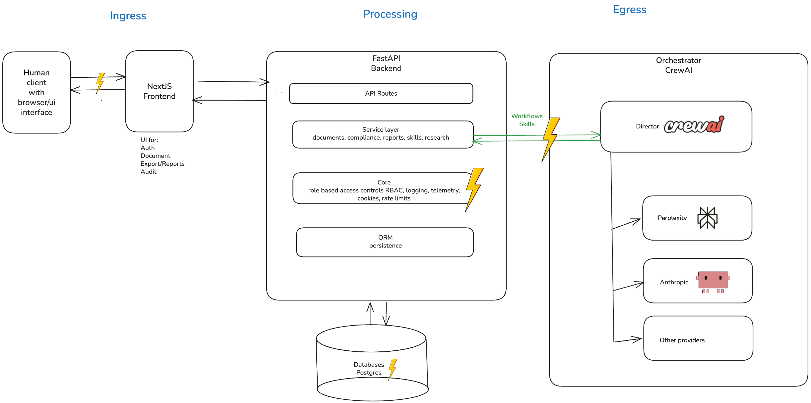

---

<!-- _class: sec32 light-body risk-detail dense -->

### LLM quality observations

- **Data**
  - `payload.provider`, `payload.model_used`, `payload.llm_temperature`
  - `payload.llm_prompt` — document text, stakeholder names, reviewer assignments
  - `payload.llm_output` — compliance summaries that may restate personal context
- **Why sensitive**
  - Prompt context from user documents with names, emails, project identifiers, and business-sensitive content
  - Output may restate that content-> both are persisted to a queryable table

---

<!-- _class: sec32 light-body risk-detail dense -->

### Audit event payload

- **Data**
  - `payload.roles` (user role at login), `payload.remember_me` flag, event-specific context fields, free-form data from orchestrator or Skills API callers
- **Why sensitive**
  - Append-only and intended for long retention
  - Callers could write personal data into the payload column
  - Combined with `actor_id` (user email) it forms a rich personal profile

---

<!-- _class: sec32 light-body risk-detail dense -->

### OpenTelemetry span attributes

- **Data**
  - HTTP path attribute (e.g., `/api/v1/documents/doc-abc123` — document ID in path), `user_agent`, `http.method`, `http.status_code`, `trace_id` / `span_id`
- **Why sensitive**
  - When `TRACING_EXPORTER=otlp`, path values can embed document or session identifiers
  - User-agent can contribute to fingerprinting

---

### Role assignments and permission scope

- **Data**:
  - user_roles array per session row (e.g., ["qm_lead"], ["auditor"]), org isolation field user_org
- **Why Sensitive**:
  - Reveals organisational responsibilities and access privileges
  - Can be used for social engineering or targeted attacks
  - GDPR data minimisation applies

---

<!-- _class: sec32 light-body risk-detail dense -->

### Frontend CSV export

- **Data**
  - Exported observability `prompt_output_pairs.csv` with prompt, output, `source_component`, `trace_id`, timestamps
- **Why sensitive**
  - Created on the user's local filesystem
  - Outside system access controls, retention policy, and audit log
  - May contain personal data from documents processed during the export window

---

### Mitigation: Application telemetry and workflow tracing

- Recommend following [OpenTelemetry best practices for handling sensitive data](https://opentelemetry.io/docs/security/handling-sensitive-data/)
- Follow the principle of data minimization, where possible.
- While it may not be optimal, try hashing user information and id and delete unhashed data.
- Consider using OTel's `redaction` processor between collection and export
- Apply similar principles to audit logs and reports

---

<!-- class: sec33 -->
<!-- _class: sec33 divider section-intro -->

# Misconfigured and stale controls give access to private data

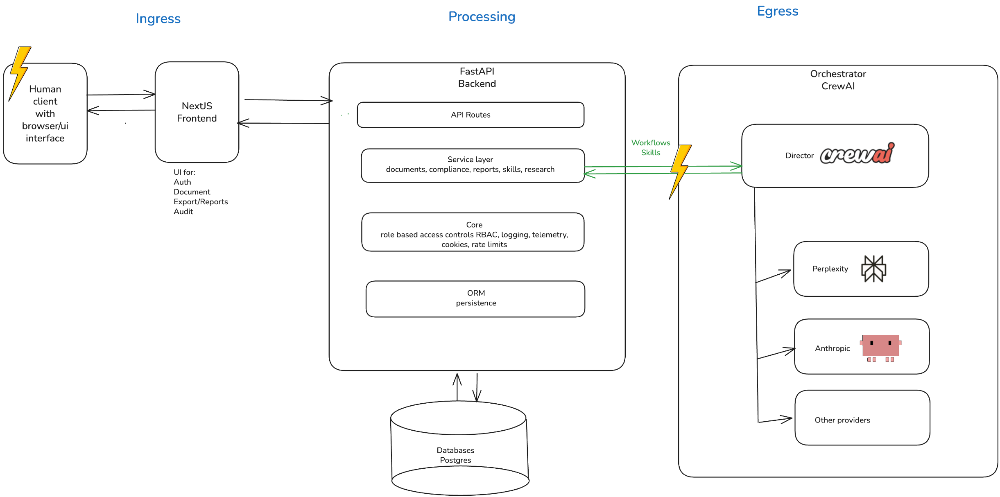

---

<!-- _class: sec33 light-body risk-detail dense -->

### User identity in session store

- **Data**
  - `user_email` (primary identifier), `user_org`, session `session_id`, `expires_at`, `last_seen_at`
- **Why sensitive**
  - Directly identifies users and links the organisational role to access patterns and audit trails
  - Retained in PostgreSQL with no visible TTL-based purge policy

---

<!-- _class: sec33 light-body risk-detail dense -->

### Role assignments and permission scope

- **Data**
  - `user_roles` array per session row (e.g., `["qm_lead"]`, `["auditor"]`), org isolation field `user_org`
- **Why sensitive**
  - Reveals organisational responsibilities and access privileges
  - Can be used for social engineering or targeted attacks
  - GDPR data minimisation applies

---

<!-- _class: sec33 light-body risk-detail dense -->

### Bootstrap/MVP credentials

- **Data**
  - `AUTH_MVP_EMAIL`, `AUTH_MVP_PASSWORD`, `AUTH_MVP_ROLES`, `AUTH_MVP_ORG` (env vars)
  - `SECRET_KEY` (API key secret)
- **Why sensitive**
  - Compromise of bootstrap credentials gives attacker a fully provisioned account with configurable roles
  - `SECRET_KEY` grants service-client access to skills and observability

---

<!-- _class: sec33 light-body risk-detail dense -->

### Access decision audit gap

- **Data**
  - Which role accessed which route at what time
  - 403 access denials
  - Service-client route usage with payload summary
- **Why sensitive**
  - Needed: Without access-decision audit log, retrospective investigation of data-access incidents is impossible
  - Required for GDPR Art. 30 "record of processing activities and breach response"

---

<!-- _class: sec33 mitigation-screens -->

### Mitigation: Role-based access controls and GDPR compliance

  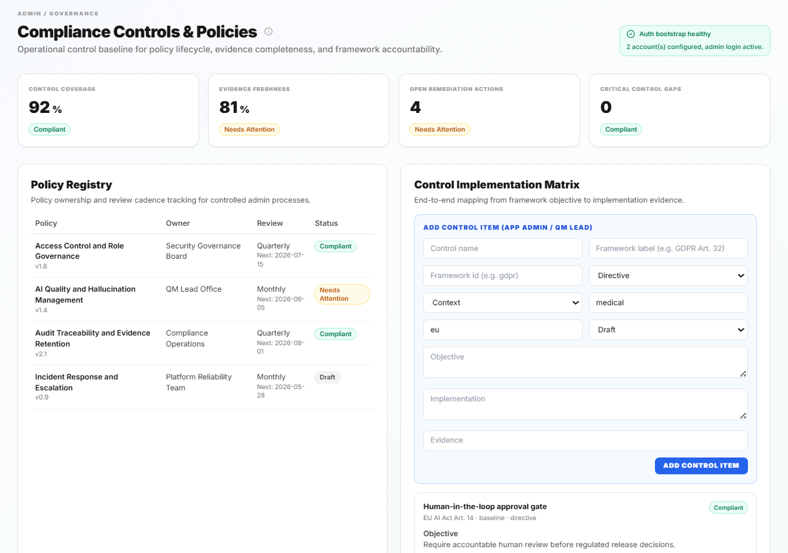
  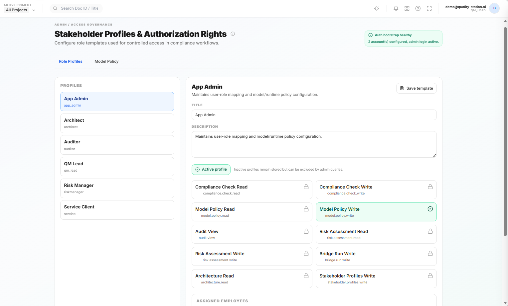

---

<!-- class: sec4 -->
<!-- _class: sec4 divider -->

# Recommendations

---

### Top priority going forward

- Harden and refine the bridge behavior use of internal models
- Focus on reducing manual work while meeting the regulatory standards
- Respond to regulatory changes

### Why it matters

- Improve ability to analyze 1000 page document by supporting a specialist with deterministic,
  privacy-conscious tools
- Reduces time for specialists to analyze document from weeks and months
- Adds flexibility to implement changes if directives change
- Reduces the need for expensive specialists to work on repetitive tasks
- Offers basic insights on what has changed, where changed, and policies affected

---

### Fit with company and risk strategy

- Strengthens customers trust in brand and products / uplift for brand reputation.
- Complies with GDPR / BSI in Germany regulations for software rules
- Main regulatory points are addressed in workflow and prepares for external audits

### Value created

- Company is prepared for being audited by external agencies
- Cost savings from moving to internal models instead of using external services
- Maximize the human's impact for Human-in-the-loop by reducing toil and increasing time to focus on complex business cases

---

<!-- class: sec5 -->
<!-- _class: sec5 divider -->

# Questions & answers

- Audit scope and findings
- Risk prioritization and trade-offs
- Mitigations and open items

---

<!-- _class: sec5 -->

# Thank you

Ilona Brinkmeier · Wiebke Meyer · Carol Willing

**Privacy audit**
https://willingc.github.io/compliance-checker/

**Application**
https://github.com/IloBe/doc_quality_compliance_check

---

<!-- class: appendix -->
<!-- _class: appendix divider -->

# Appendix

- DocQuality Bridge workflow screens
- DocQuality Admin screens
- DocQuality Compliance standards screens

---

<!-- _class: appendix -->

### Bridge workflow — orchestration

  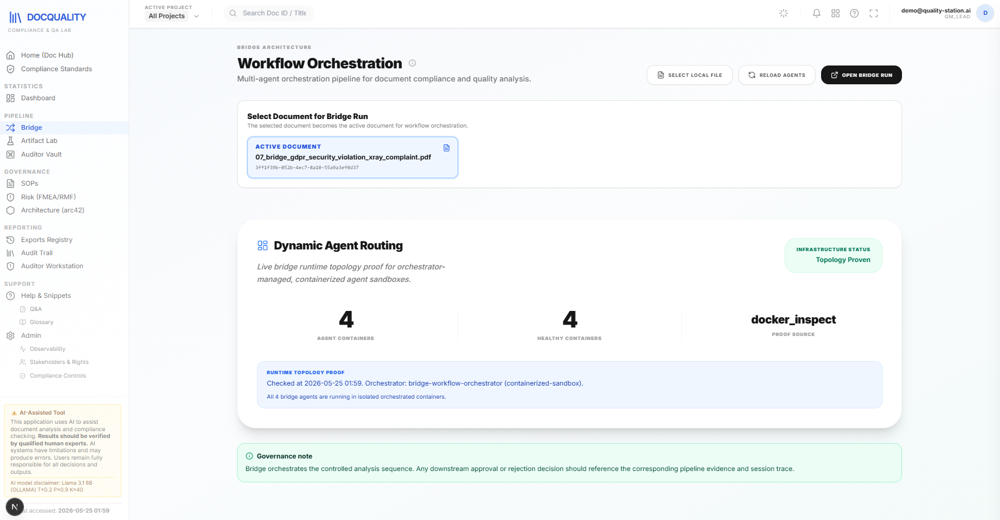

---

<!-- _class: appendix -->

### Bridge workflow — run steps 1–2

  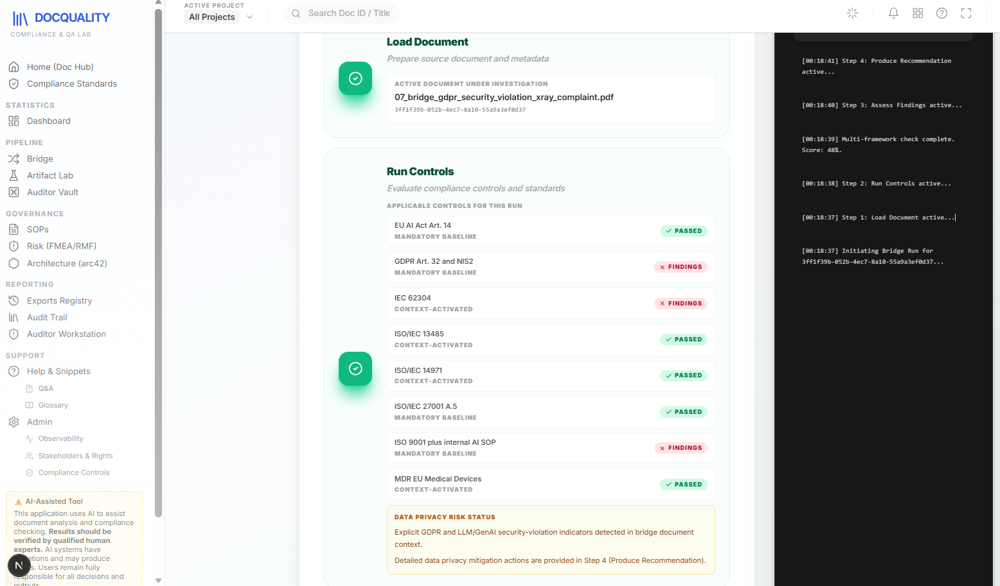
  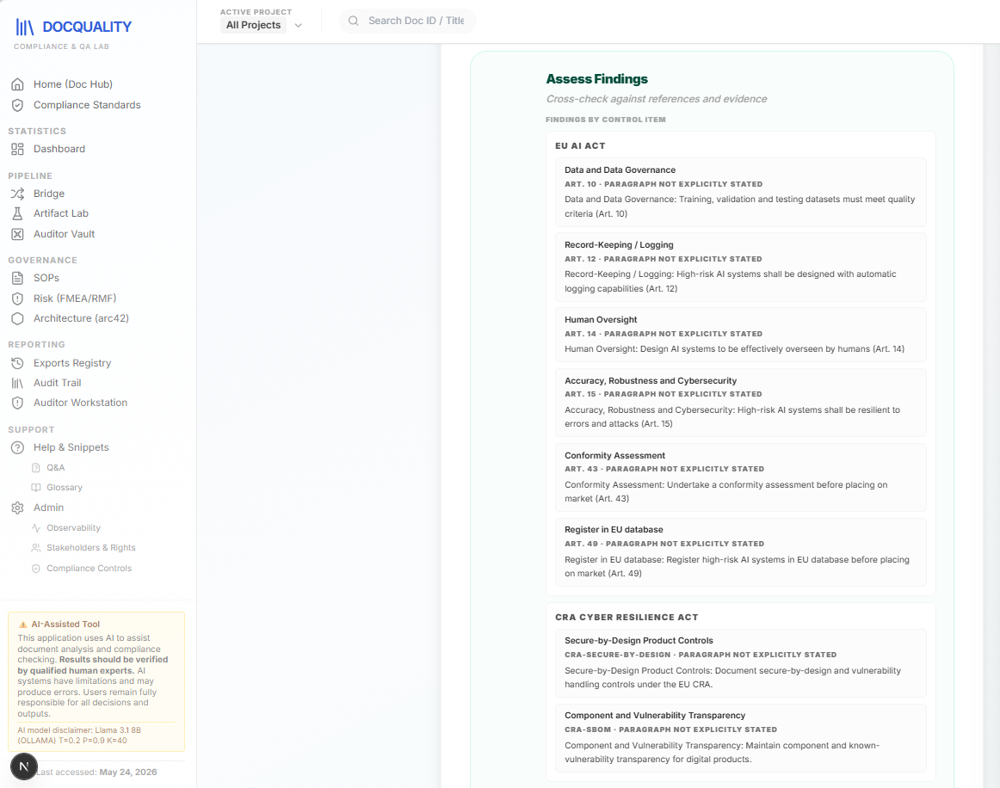

---

<!-- _class: appendix -->

### Bridge workflow — run steps 4–4b

  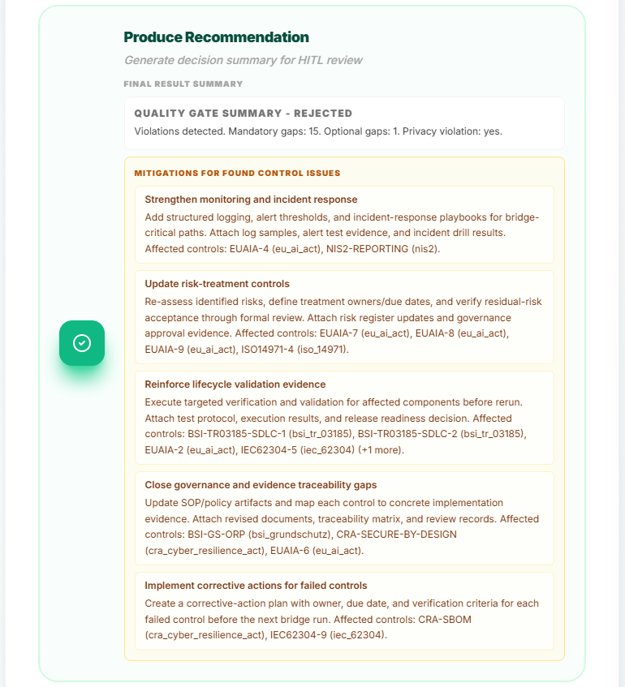
  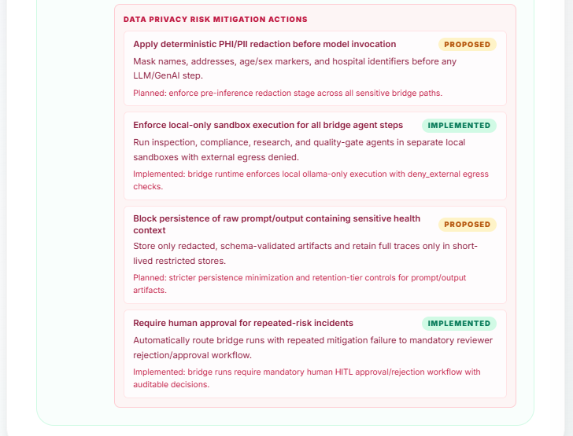

---

<!-- _class: appendix -->

### Bridge workflow — run step 5

  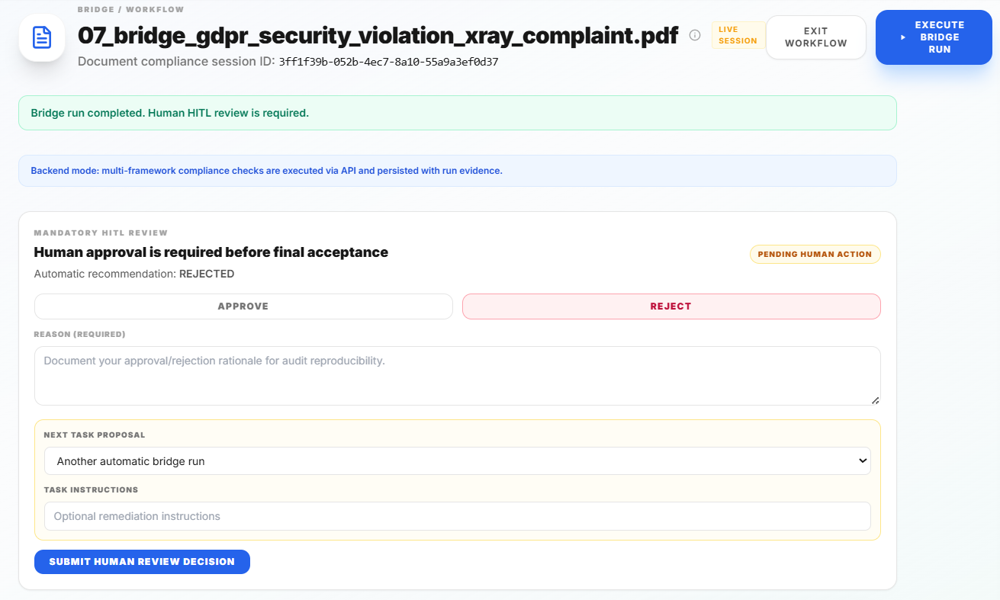

---

<!-- _class: appendix -->

### Admin — governance & access control

  
  

---

<!-- _class: appendix -->

### Compliance standards — mandatory & optional

  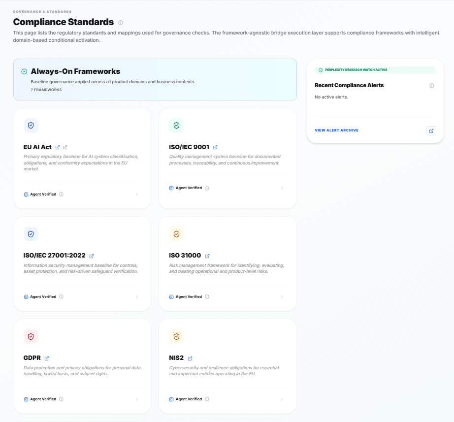
  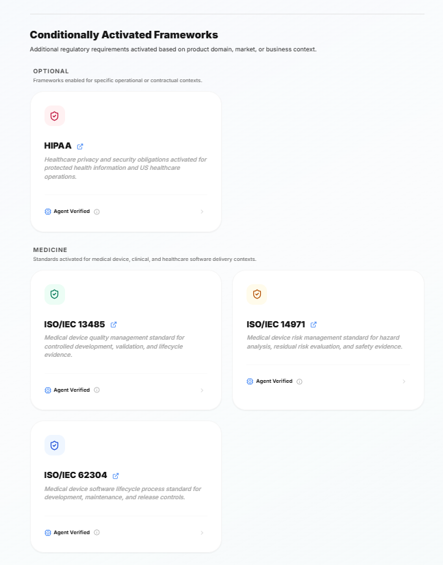

